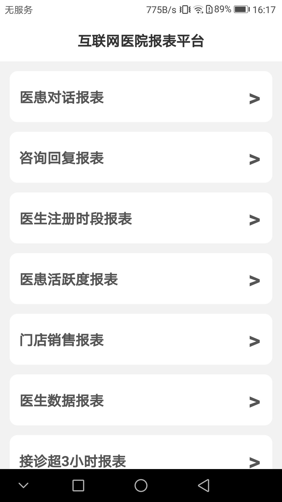
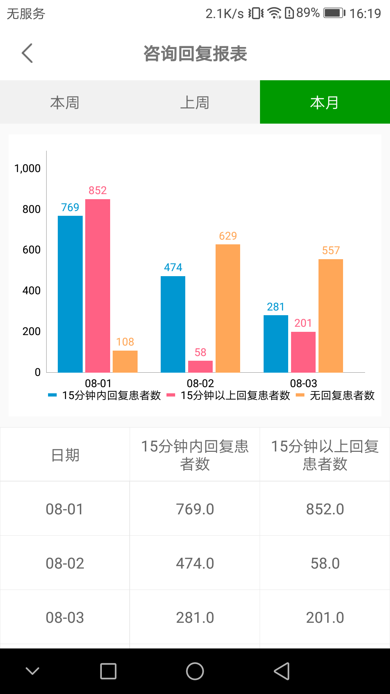
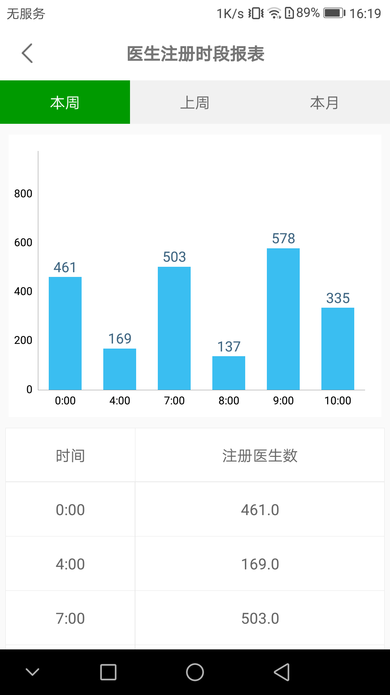
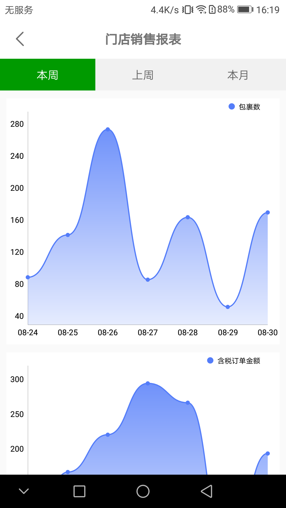

# MPChartReport
MpAndroidChart图表演示，用kotlin，mvvm，viewmodel完成双曲线，单曲线，单柱状，组柱状图的报表
体验请下载的 
[报表app.apk](https://github.com/AndMy/MPChartReport/tree/master/app/release/报表平台demo.apk)

* 图片可能加载很慢，可下载到本地
   ```
   图片可能加载很慢，可下载到本地
   ```

## 效果图 
<a href="img/1.jpg"></a> <a href="img/2.jpg"></a> <a href="img/3.png"></a>

<a href="img/4.png"></a> <a href="img/5.jpg"></a> <a href="img/6.png"></a>